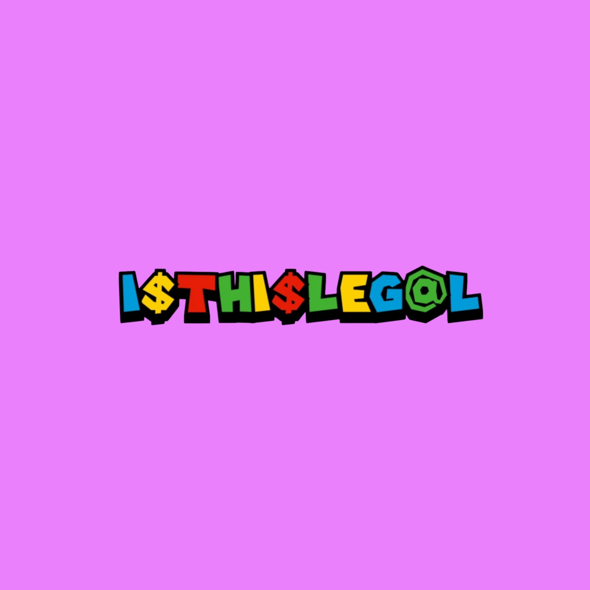

# i$THI$LEG@L.XYZ The Future of Truth Meme-based Cryptocurrency

**YOUR ILLEGAL-STYLED DIGITAL CURRENCY!**

## Project Description

### The Future of Truth Meme-based Cryptocurrency
Our meme-based cryptocurrency is not just a financial asset; it is a cultural revolution. By leveraging the power of memes, we create a decentralized, community-driven digital currency that thrives on humor, creativity, and collective engagement. This currency aims to democratize financial systems, making them accessible to all while fostering a sense of unity and joy within the crypto community. It is the embodiment of truth, transparency, and the irrepressible spirit of internet culture.

### Your Illegal-style Digital Currency
Daring and unconventional, this currency embraces the "illegal-style" to challenge traditional financial norms and regulatory frameworks. While adhering to legal boundaries, we push the envelope by adopting rebellious aesthetics and innovative features. Our digital currency is designed for those who dare to question the status quo, offering a secure, private, and efficient medium of exchange that aligns with the ethos of the unyielding and the bold.

Together, these two initiatives represent a bold leap into the future of digital finance, where truth and rebellion coexist to reshape the landscape of global economies.

## Connect with Us
- [Twitter](https://x.com/isthislegalxyz)
- [GitHub](https://github.com/m3m3s4zero4)
- [Discord](https://discord.com/invite/gJMQr9jC)

